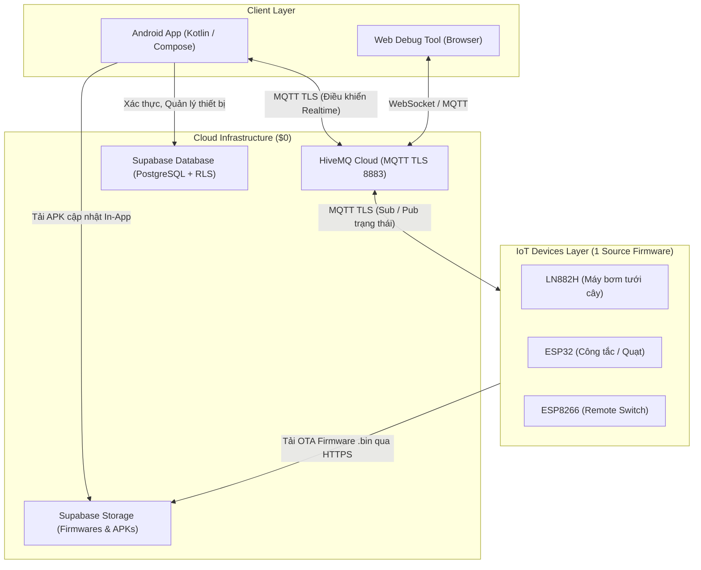

# Smart Home Platform

Hệ sinh thái IoT cá nhân chi phí hạ tầng **$0** (HiveMQ Cloud Serverless + Supabase Free Tier):
- **Firmware 1-source**: Cùng một codebase duy nhất điều khiển máy bơm, công tắc, điều khiển từ xa, đèn, quạt... hỗ trợ đồng thời nhiều dòng vi điều khiển khác nhau (**LN882H / LibreTiny**, **ESP32**, **ESP8266**).
- **Android App**: Ứng dụng Android viết bằng Kotlin & Jetpack Compose, giao tiếp trực tiếp realtime với thiết bị qua giao thức MQTT TLS, đồng bộ dữ liệu và hỗ trợ cập nhật ứng dụng tự động in-app qua Supabase.
- **Tự động hóa phát hành (Automation Tools)**: Bộ script CLI tự động hóa build, tạo mã băm kiểm tra tính toàn vẹn (checksum), upload bản phát hành firmware OTA và cập nhật Android APK lên Supabase Storage & Database.

---

## 1. Kiến Trúc Tổng Thể



---

## 2. Cấu Trúc Thư Mục

```text
smart-home-platform/
├── app/                          # Ứng dụng Android (Kotlin / Jetpack Compose / Material 3)
│   ├── app/                      # Module Android chính (UI, ViewModels, MQTT, In-App Update)
│   └── build.gradle.kts          # Cấu hình build Android Gradle
├── firmware/                     # Firmware 1-source tree cho MỌI thiết bị và MCU
│   ├── include/                  # Header dùng chung toàn firmware
│   ├── src/
│   │   ├── main.cpp              # Điểm khởi chạy (BẤT BIẾN, không chứa #ifdef)
│   │   ├── core/                 # Logic lõi: MQTT, CommandHandler, OTA, Pairing, Identity
│   │   ├── compat/               # kv.h, tls.h, rt.h, pm.h (nơi khai báo #ifdef duy nhất)
│   │   ├── chip/                 # anchor.cpp, softap.cpp, io.cpp (SDK riêng theo từng chip)
│   │   └── profiles/             # pump/ switch/ remote_switch/ — chỉ chứa phần khác nhau của thiết bị
│   ├── boards/  lib/             # Cấu hình bo mạch & thư viện phụ trợ
│   └── platformio.ini            # Định nghĩa môi trường build (board × profile)
├── supabase/
│   └── migrations/               # Các bản migration SQL (0001_init.sql đến 0010_app_releases.sql)
├── tools/                        # Bộ công cụ CLI Python & Script tự động hóa
│   ├── upload_app_update.py      # Upload Android APK lên Supabase Storage & lưu bản ghi DB
│   ├── upload_firmware.py        # Build PlatformIO, hash SHA256/MD5, upload binary OTA lên Supabase
│   ├── seed_mqtt_credential.ps1  # Khởi tạo thông tin xác thực MQTT dùng chung vào DB
│   └── web_debug/                # Web Dashboard kiểm thử & giám sát giao thức thiết bị
└── docs/                         # Tài liệu kiến trúc và hướng dẫn kỹ thuật chi tiết
```

---

## 3. Quy Tắc Thiết Kế Bắt Buộc (Core Principles)

Tuân thủ nghiêm ngặt các quy tắc kiến trúc sau khi phát triển codebase:

1. **Bất biến lớp Core**:
   - `firmware/src/core/` và `firmware/src/main.cpp` là **bất biến, tuyệt đối không dùng `#ifdef`** — chỉ sử dụng API chuẩn Arduino/C++ tiêu chuẩn.
2. **Khai báo phần cứng độc lập**:
   - Mọi khác biệt về tập lệnh vi điều khiển, SDK và include được cô lập tại `firmware/src/compat/` (nơi duy nhất được phép có `#ifdef`) và `firmware/src/chip/` (triển khai SDK riêng cho từng chip: LN882H, ESP32, ESP8266).
3. **Mở rộng thiết bị mới**:
   - Thêm thiết bị mới chỉ cần tạo thư mục trong `firmware/src/profiles/<tên_thiết_bị>/` và thêm `[env:...]` tương ứng trong `firmware/platformio.ini`. Không tạo file `main` riêng biệt.
4. **Bảo mật**:
   - Tuyệt đối không commit bí mật (HiveMQ credentials, Supabase keys, JWT secret) vào Git — luôn sử dụng biến môi trường qua file `.env`.
   - Firmware chỉ phụ thuộc vào MQTT (HiveMQ Cloud); Supabase chỉ phục vụ cho App Android và lưu trữ OTA.

---

## 4. Cài Đặt & Cấu Hình Môi Trường

### 4.1. Cấu hình biến môi trường (`.env`)

Sao chép file `.env.example` thành `.env` tại thư mục gốc dự án:

```powershell
cp .env.example .env
```

Điền các thông tin bí mật vào `.env`:

```env
# Supabase
SUPABASE_URL=https://<your-project-ref>.supabase.co
SUPABASE_ANON_KEY=<your-anon-key>
SUPABASE_SERVICE_KEY=<your-service-role-key>

# HiveMQ Cloud (Serverless MQTT TLS)
HIVE_MQTT_HOST=<your-cluster-url>.hivemq.cloud
HIVE_MQTT_PORT=8883
HIVE_MQTT_USER=<shared-device-username>
HIVE_MQTT_PASS=<shared-device-password>

# Build-time Secret Firmware (tùy chọn)
FW_SECRET=
```

### 4.2. Môi trường công cụ Python

```powershell
python -m venv tools/.venv
.\tools\.venv\Scripts\Activate.ps1
pip install -r tools/requirements.txt
```

### 4.3. Thiết lập Cơ sở dữ liệu Supabase

Chạy lần lượt các file script trong thư mục [supabase/migrations/](file:///d:/projects/smart-home-platform/supabase/migrations/) tại mục **SQL Editor** trên Supabase Dashboard:
- `0001_init.sql` → `0008_sharing.sql`: Khởi tạo bảng dữ liệu thiết bị, người dùng, quyền truy cập và chia sẻ gia đình.
- `0009_firmware_releases.sql`: Khởi tạo bucket Storage `firmwares`, bảng `firmware_releases` và RPC `get_latest_firmware()`.
- `0010_app_releases.sql`: Khởi tạo bucket Storage `app-releases`, bảng `app_versions` và RPC `get_latest_app_version()`.

---

## 5. Hướng Dẫn Thao Tác (Workflows)

### 5.1. Build Firmware (PlatformIO)

Cài đặt [PlatformIO CLI](https://platformio.org/install/cli) hoặc tiện ích PlatformIO trên VS Code / Cursor / IDE.

```powershell
# Chuyển vào thư mục firmware
cd firmware

# Build máy bơm nước (LN882H / LibreTiny)
pio run -e pump-ln882h

# Build máy bơm nước (ESP32)
pio run -e pump-esp32

# Build công tắc thông minh (ESP32)
pio run -e switch_esp32

# Build công tắc thông minh (ESP8266)
pio run -e switch_esp8266

# Build điều khiển từ xa (ESP8266)
pio run -e remote_switch_esp8266
```

### 5.2. Phát Hành Firmware OTA lên Cloud (`upload_firmware.py`)

Script tự động gọi PlatformIO build, tính mã băm SHA256/MD5, tải binary `.bin` lên Supabase Storage và lưu vào bảng `firmware_releases`:

```powershell
# Xem danh sách các môi trường build hỗ trợ
python tools/upload_firmware.py --list

# Tự động build và upload firmware cho một môi trường
python tools/upload_firmware.py -e pump-ln882h --build

# Build và upload toàn bộ môi trường
python tools/upload_firmware.py -e all --build
```

### 5.3. Phát Hành Bản Cập Nhật Ứng Dụng Android (`upload_app_update.py`)

Khi xuất bản file APK Android mới (Release APK):

```powershell
python tools/upload_app_update.py `
  --apk "app/app/release/app-release.apk" `
  --version-code 3 `
  --version-name "1.0.2" `
  --notes "Cải thiện kết nối MQTT và tối ưu giao diện" `
  --mandatory false
```

Script sẽ upload file APK lên Storage bucket `app-releases` và thêm thông tin vào bảng `app_versions`. Khi người dùng mở app Android, ứng dụng sẽ tự động nhận diện và nhắc người dùng cập nhật.

### 5.4. Khởi Chạy Web Debug Dashboard

Dùng để mô phỏng và gỡ lỗi gói tin MQTT / WebSocket trực tiếp trên trình duyệt:

```powershell
python tools/web_debug/bridge_server.py
```

Truy cập: `http://localhost:8080`

---

## 6. Tài Liệu Kỹ Thuật Chi Tiết

Mọi chi tiết kỹ thuật chuyên sâu được lưu trữ trong thư mục [docs/](file:///d:/projects/smart-home-platform/docs/):

| Tài liệu | Nội dung chi tiết |
| :--- | :--- |
| [ECOSYSTEM_PLAN.md](file:///d:/projects/smart-home-platform/docs/ECOSYSTEM_PLAN.md) | Bản thiết kế kiến trúc toàn diện của hệ sinh thái, mục tiêu chi phí $0, mô hình bảo mật và roadmap |
| [SOURCE_STRUCTURE.md](file:///d:/projects/smart-home-platform/docs/SOURCE_STRUCTURE.md) | Cấu trúc phân lớp chi tiết của mã nguồn firmware (Core, Compat, Chip, Profiles) |
| [IDENTITY_AND_PAIRING.md](file:///d:/projects/smart-home-platform/docs/IDENTITY_AND_PAIRING.md) | Quy trình định danh thiết bị, cơ chế ghép nối (Pairing), sinh khóa mã hóa và chia sẻ điều khiển |
| [BINARY_PROTOCOL.md](file:///d:/projects/smart-home-platform/docs/BINARY_PROTOCOL.md) | Định dạng gói tin nhị phân và giao thức truyền thông tối ưu qua MQTT / WebSocket |
| [OTA_FIRMWARE_GUIDE.md](file:///d:/projects/smart-home-platform/docs/OTA_FIRMWARE_GUIDE.md) | Hướng dẫn chi tiết quy trình cập nhật firmware OTA qua Supabase Storage & Database |
