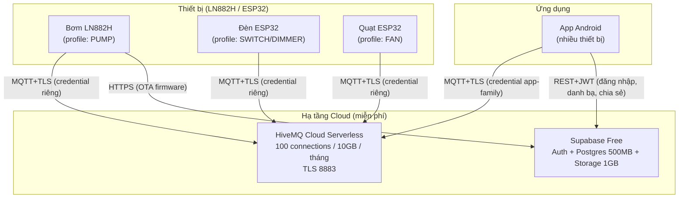
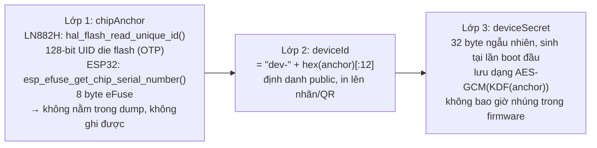
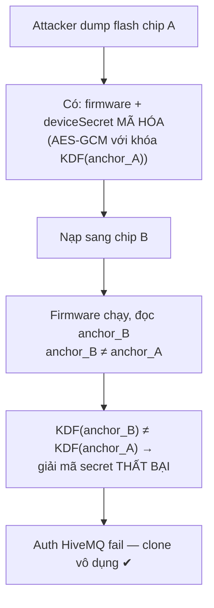
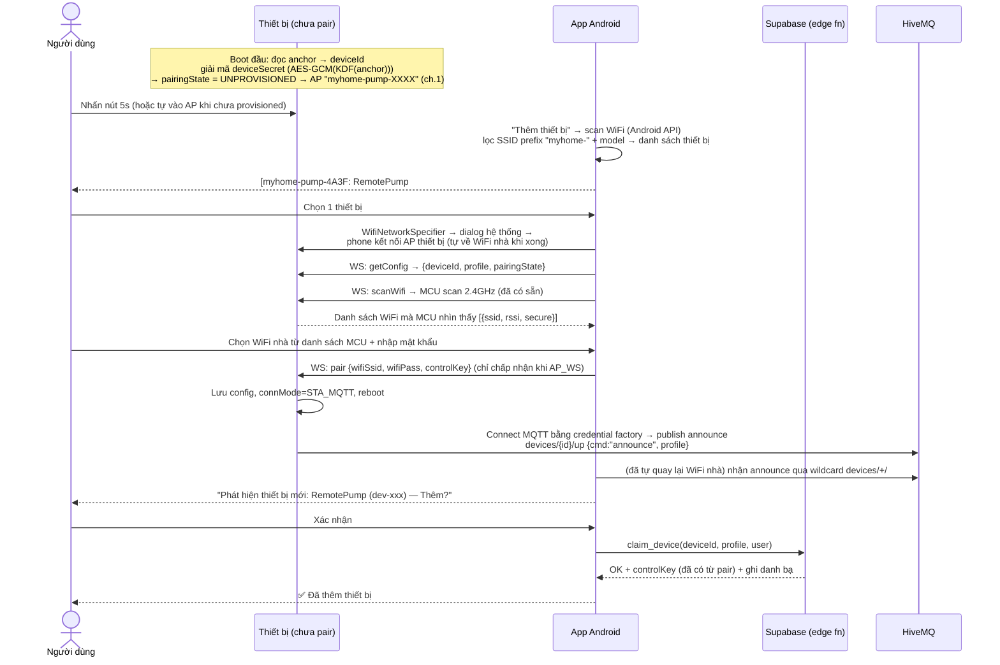
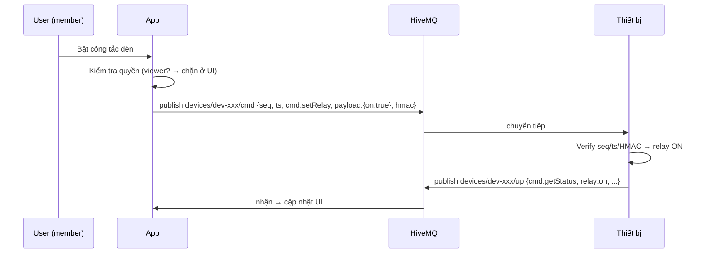
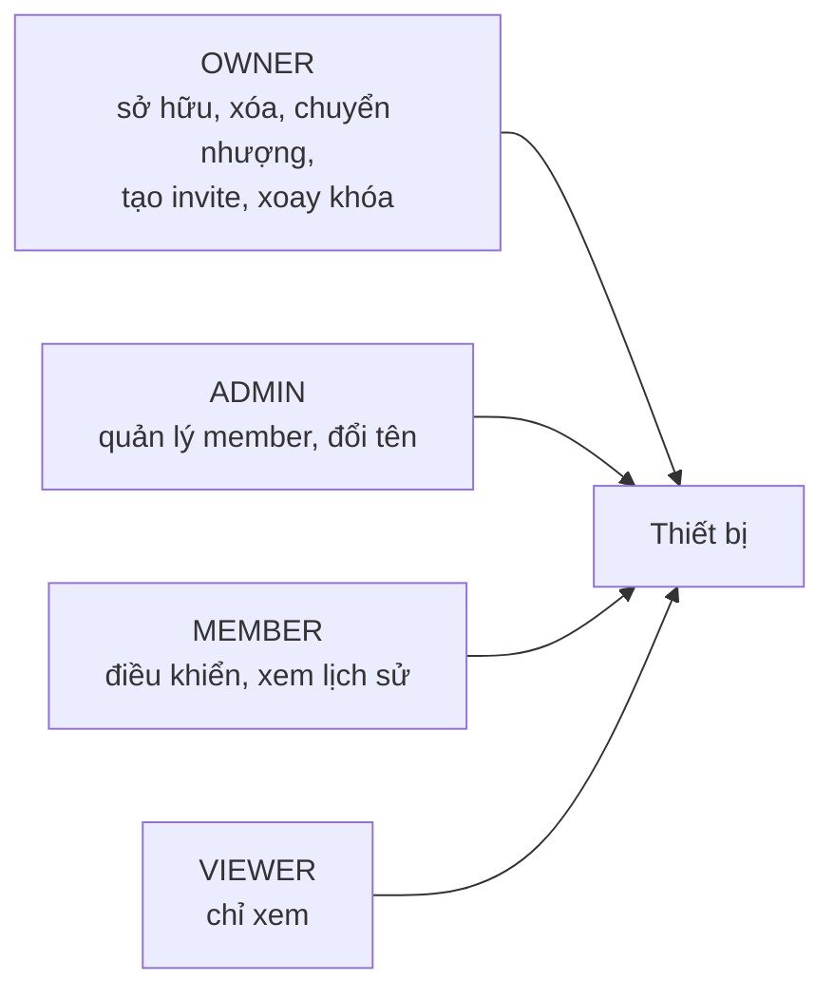
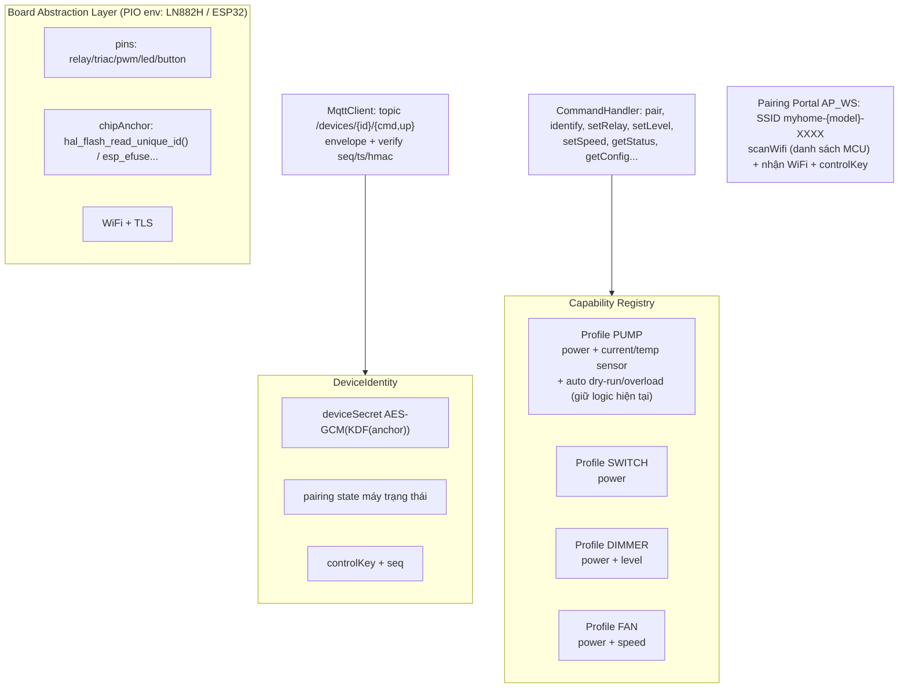

# KẾ HOẠCH HỆ SINH THÁI IoT CÁ NHÂN — Chi phí hạ tầng $0

> Mục tiêu: hệ sinh thái thiết bị thông minh (bơm, đèn, quạt...) điều khiển qua app Android, điều khiển từ xa, xác thực thiết bị, chống clone (dump firmware), phân quyền & chia sẻ — với chi phí hạ tầng = $0.

## 1. Kiến trúc tổng thể



**Nguyên tắc tách lớp quan trọng:** thiết bị chỉ phụ thuộc MQTT (HiveMQ — không bao giờ pause). Supabase chỉ phục vụ app (tài khoản, danh bạ, phân quyền). Nếu Supabase free bị pause sau 7 ngày không hoạt động, thiết bị vẫn hoạt động bình thường.

## 2. Danh tính & xác thực thiết bị (lõi bảo mật)

### 2.1 Ba lớp danh tính



| Lớp | Giá trị | Độ nhạy | Nơi lưu |
|---|---|---|---|
| chipAnchor | UID phần cứng | Công khai (của chip) | OTP/eFuse — **không đọc được từ dump** |
| deviceId | Dẫn xuất từ anchor | Công khai | Nhãn/QR + Supabase |
| deviceSecret | Ngẫu nhiên 32B | Bí mật | eFlash (mã hóa) + HiveMQ credential |

**Tại sao không dùng `lt_cpu_get_unique_id()`:** bản weak chỉ trả 24 bit cuối của MAC hiệu dụng — và MAC hiệu dụng bị override được (`wifi_set_macaddr`/`netdev_set_mac_addr`). Đã verify trong source LibreTiny/LN882H. Anchor chuẩn: `hal_flash_read_unique_id()` (đọc qua lệnh 0x4B — UID nằm trong OTP die flash, không phải vùng địa chỉ flash nên **dump không lấy được**, và không thể ghi đè).

### 2.2 Chống dump → nạp thiết bị khác



### 2.3 Ma trận tấn công & phòng thủ

| Kịch bản tấn công | Cơ chế chống | Hiệu quả |
|---|---|---|
| Dump flash → nạp board khác | AES-GCM + KDF(anchor) | ✅ Clone không auth được |
| Sửa MAC để "khớp" identity | Anchor không phải MAC; dùng UID die flash | ✅ Không sửa được |
| Recompile firmware bỏ check | LN882H: không có secure boot → dựa cloud detection; ESP32 (ESP-IDF): secure boot v2 + flash encryption (nâng cấp tùy chọn) | ⚠️ Tùy nền tảng |
| Replay lệnh | `seq` tăng dần + `ts` + HMAC controlKey, device từ chối seq cũ | ✅ |
| Chạy 2 thiết bị cùng danh tính | Client ID cố định → HiveMQ kick session cũ + app cảnh báo offline bất thường | ✅ |
| Tái activate vào tài khoản khác | Server-side revocation khi re-pair | ✅ |

## 3. Giao thức truyền thông

### 3.1 Topic namespace

```
devices/{deviceId}/cmd     ← lệnh app → thiết bị (QoS 1)
devices/{deviceId}/up      → trạng thái thiết bị → app (QoS 1, retained = trạng thái mới nhất)
```

### 3.2 Envelope lệnh (anti-replay, xác thực lệnh)

```json
{
  "reqId": "uuid-ngắn",
  "seq": 1024,
  "ts": 1750000000,
  "cmd": "setLevel",
  "payload": { "level": 80 },
  "hmac": "hex64"   // HMAC-SHA256(controlKey, seq|ts|payload)
}
```

- `controlKey` (32B): sinh bởi thiết bị khi pair, lưu mã hóa trên thiết bị + Supabase (RLS) → phân phối cho các app được chia sẻ
- Thiết bị kiểm tra: `seq > seq_cuối` + `|now - ts| < 60s` + HMAC hợp lệ → mới thực thi
- Trạng thái `up` không cần ký (đã qua TLS + broker auth), kèm `seq` để app phát hiện lệch nhịp

### 3.3 Credential HiveMQ (theo quy tắc, gen tự động)

| Client | Username | Password | Permission (topic filter) |
|---|---|---|---|
| Thiết bị | `device-{deviceId}` | `deviceSecret` (sinh lúc factory provisioning) | `devices/{deviceId}/#` pub+sub |
| App gia đình | `app-family` | random, tạo 1 lần trong console | `devices/+/#` pub+sub |

**Bước tay duy nhất (2 phút/thiết bị):** HiveMQ Serverless free **không có REST API** (chỉ Starter trả phí) → credential thiết bị được dán vào HiveMQ console **ngay lúc factory provisioning** (khi nạp firmware cho board mới) — user không phải mở console khi pair sau này. App-family tạo 1 lần duy nhất.

## 4. Flow "Thêm thiết bị" (pairing — 2 bước: phone scan → MCU scan)

### 4.0 Factory provisioning (lúc nạp firmware cho board mới, trên PC — ~2 phút)

| Việc | Công cụ |
|---|---|
| Đọc anchor → deviceId (`dev-...`), SSID AP cố định `myhome-{model}-{4hex}` (từ deviceId + profile) | `tools/` script (đọc qua serial/đã biết ở flash) |
| Sinh `deviceSecret` (32B) + `controlKey` | script |
| Tạo credential HiveMQ `device-{deviceId}` / password = secret, permission `devices/{deviceId}/#` | HiveMQ console (dán — HiveMQ free không REST API) |
| Inject config (credential, AP SSID/pass) vào partition config | script |

Thiết bị chưa có credential → không auth MQTT được → **không bao giờ online trên cloud** (deny mặc định).

### 4.1 Sơ đồ flow



### 4.2 Command protocol (WS pairing portal)

```json
// App → device (AP_WS mode):
{ "cmd": "getConfig" }                                   // đã có
{ "cmd": "scanWifi" } → { "cmd": "getScanWifiData" }     // đã có, MCU scan async
{ "cmd": "pair", "payload": { "wifiSsid": "Nha-Toi", "wifiPass": "...", "controlKey": "hex64" } }
```

- `pair` chỉ được xử lý khi `connMode == AP_WS` (chặn từ MQTT/STA — bảo mật)
- AP SSID format cố định `myhome-{model}-{4hex}` do firmware tự build từ profile + anchor (không phải config tay) → app lọc được

### 4.3 Bằng chứng proximity & an toàn

- **Proximity**: phải ở gần thiết bị (AP 2.4GHz phạm vi ~10m) + announce chỉ đến từ WiFi nhà → bỏ `pairingCode` (thiết bị không màn hình không hiển thị được)
- `claim_device` rate limit; chỉ 1 owner; re-pair (factory reset) → revocation server-side
- Thiết bị chưa provisioned: **deny mặc định** — chỉ mở WS pairing, không có quyền gì trên cloud

## 5. Flow điều khiển & chia sẻ



## 6. Phân quyền & chia sẻ



- **Owner → tạo invite**: app sinh mã invite (role, hết hạn) → người khác nhập → thành member
- **2 tầng enforce**: Supabase RLS (ai thấy/truy cập thiết bị nào) + app UI (viewer ẩn nút điều khiển). Broker ACL coarse (`devices/+/#`) — tradeoff chấp nhận với HiveMQ free (mỗi credential chỉ 1 permission)

**Schema Supabase:**

```sql
devices         (id uuid pk, device_id text unique, profile text, name text,
                 owner_id uuid → auth.users, status text, control_key bytea,
                 pair_code_hash text, created_at timestamptz)
device_members  (device_id fk, user_id fk, role text, pk(device_id,user_id))
invites         (code text pk, device_id fk, role text, expires_at timestamptz)
```

RLS: select/update qua `device_members`; insert = chỉ edge fn `claim_device` (SECURITY DEFINER); invite chỉ owner.

## 7. Firmware — kiến trúc



**Thêm thiết bị mới = thêm 1 profile + cấu hình pin** — không sửa core.

## 8. App Android — kiến trúc

```
Màn hình:
  Login/Register (Supabase Auth)
  Device List  ──►  [＋ Thêm thiết bị] ──► Pairing Wizard (mục 4)
  Device Dashboard (render theo profile: PumpCard/SwitchCard/DimmerSlider/FanCard)
  Device Management (đổi tên, xóa, chuyển nhượng, chia sẻ, xoay khóa)
  Invite Screen (tạo/nhập mã, quản lý member)

Data:
  Room (danh bạ cache) + Supabase REST (danh bạ, quyền)
  MqttDeviceChannel theo từng device (giữ lại HybridDeviceChannel)
  Thay config local.properties cứng → registry động
```

## 9. OTA

- Firmware upload → Supabase Storage (1GB free) → URL HTTPS → giữ nguyên cơ chế OTA verify + rollback hiện có (OtaVerify/boot guard)

## 10. Lộ trình triển khai

| Phase | Nội dung | Deliverable |
|---|---|---|
| **P1** | Hạ tầng cloud | Supabase project + SQL migration (schema+RLS+edge fn `claim_device`); tạo credential `app-family` trong HiveMQ console; script test MQTT trong `tools/` |
| **P2** | Firmware core | Board abstraction; DeviceIdentity (anchor + AES-GCM blob + máy trạng thái pairing); Pairing Portal AP_WS (`myhome-{model}-XXXX`, `pair` command, scanWifi trong AP); envelope seq/ts/hmac; MQTT per-device auth + topic mới; revocation khi re-pair; verify scan khi đang ở AP mode |
| **P3** | Firmware profiles | SWITCH/DIMMER/FAN (cùng codebase, build thử ESP32); PUMP giữ nguyên |
| **P4** | App core | Login; Device List + Add Device (scan AP `myhome-` prefix → WifiNetworkSpecifier → chọn WiFi từ danh sách MCU → claim); refactor repository/navigation |
| **P5** | App device UI | Màn hình theo capability; quản lý thiết bị |
| **P6** | Chia sẻ & hoàn thiện | Invite/roles; OTA qua Supabase Storage; cảnh báo clone (offline bất thường/seq lệch); tài liệu |

## 11. Việc bạn cần làm (tổng cộng ~30 phút, 0 đồng)

1. Tạo project Supabase free → lấy `SUPABASE_URL` + `anon key`
2. HiveMQ console: tạo 1 credential `app-family` (permission `devices/+/#`)
3. Khi flash mỗi board mới: sinh credential (`tools/` script) + dán vào console (~2 phút) — bước tay duy nhất

## 12. Tradeoffs đã xác nhận

- HiveMQ free: 1 bước tay/thiết bị (không REST API); 100 connections — dư cho gia đình
- Supabase free: pause sau 7 ngày không hoạt động → thiết bị không phụ thuộc (thiết kế tách lớp)
- Broker ACL coarse cho app-family → phân quyền chi tiết enforce ở Supabase RLS + UI
- LN882H không secure boot → chống "kẻ có chip thật + recompile" dựa cloud detection; ESP32 có thể nâng cấp secure boot v2 (tùy chọn)
- Android 10+: kết nối AP thiết bị luôn có 1 dialog xác nhận của hệ thống (`WifiNetworkSpecifier` — ràng buộc OS, không bypass); cần permission vị trí (Android <13) / `NEARBY_WIFI_DEVICES` (13+); scan khi đang nối WiFi khác có thể hạn chế channel → AP thiết bị cố định channel 1
