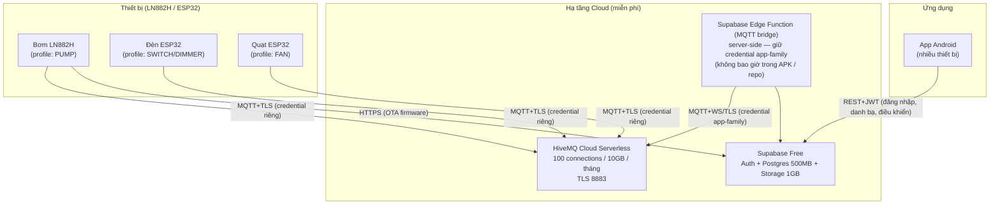
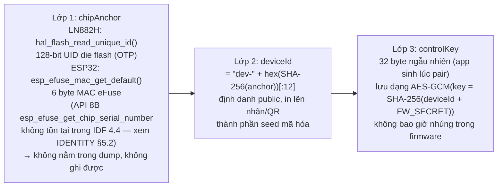
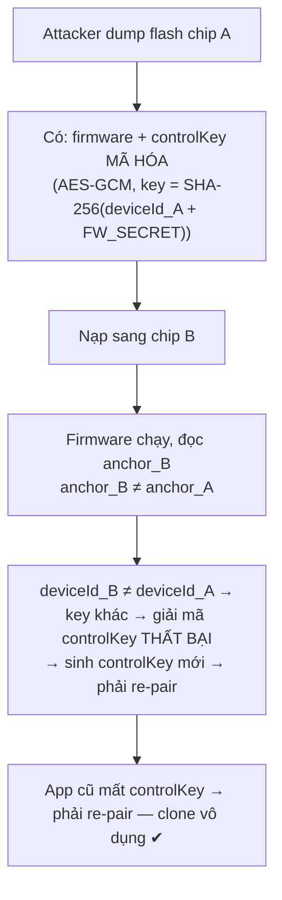
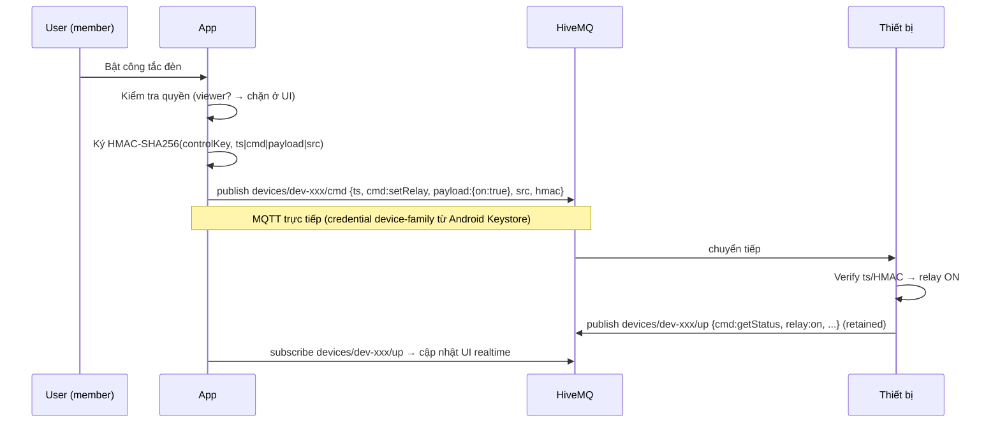
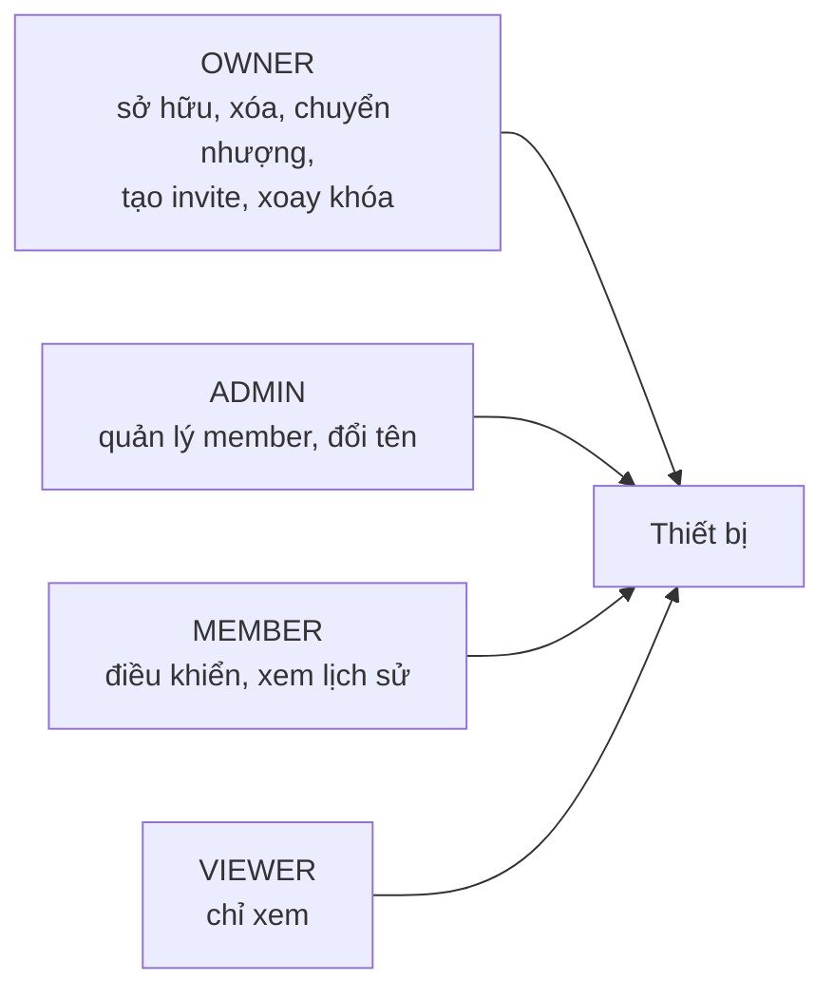
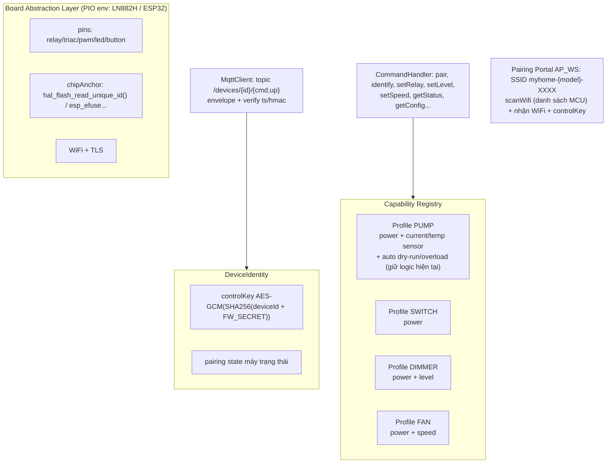

# KẾ HOẠCH HỆ SINH THÁI IoT CÁ NHÂN — Chi phí hạ tầng $0

> Mục tiêu: hệ sinh thái thiết bị thông minh (bơm, đèn, quạt...) điều khiển qua app Android, điều khiển từ xa, xác thực thiết bị, chống clone (dump firmware), phân quyền & chia sẻ — với chi phí hạ tầng = $0.

## 1. Kiến trúc tổng thể



**Nguyên tắc tách lớp quan trọng:** thiết bị chỉ phụ thuộc MQTT (HiveMQ — không bao giờ pause). Supabase chỉ phục vụ app (tài khoản, danh bạ, phân quyền). Nếu Supabase free bị pause sau 7 ngày không hoạt động, thiết bị vẫn hoạt động bình thường.

**App KHÔNG kết nối MQTT trực tiếp** (project open-source → credential không bao giờ nằm trong APK/repo). Mọi lệnh/trạng thái đi qua Supabase: app gọi RPC `send_command`/`get_device_state` → **Edge Function bridge** (chạy trong Supabase, giữ credential `app-family` ở Function Secrets) → HiveMQ ↔ thiết bị.

## 2. Danh tính & xác thực thiết bị (lõi bảo mật)

### 2.1 Ba lớp danh tính



| Lớp | Giá trị | Độ nhạy | Nơi lưu |
|---|---|---|---|
| chipAnchor | UID phần cứng | Công khai (của chip) | OTP/eFuse — **không đọc được từ dump** |
| deviceId | Dẫn xuất từ SHA-256(anchor) — cắt 6 byte đầu (gộp đủ entropy 2 nền MCU, deterministic) | Công khai | Nhãn/QR + Supabase |
| controlKey | Ngẫu nhiên 32B (app sinh lúc pair) | Bí mật | eFlash (mã hóa AES-GCM, key = SHA-256(deviceId + FW_SECRET)) + app/Supabase |

**Tại sao không dùng `lt_cpu_get_unique_id()`:** bản weak chỉ trả 24 bit cuối của MAC hiệu dụng — và MAC hiệu dụng bị override được (`wifi_set_macaddr`/`netdev_set_mac_addr`). Đã verify trong source LibreTiny/LN882H. Anchor chuẩn: `hal_flash_read_unique_id()` (đọc qua lệnh 0x4B — UID nằm trong OTP die flash, không phải vùng địa chỉ flash nên **dump không lấy được**, và không thể ghi đè).

### 2.2 Chống dump → nạp thiết bị khác



### 2.3 Ma trận tấn công & phòng thủ

| Kịch bản tấn công | Cơ chế chống | Hiệu quả |
|---|---|---|
| Dump flash → nạp board khác | AES-GCM + KDF(SHA256(deviceId + FW_SECRET)) | ✅ Clone phải re-pair, không dùng được |
| Sửa MAC để "khớp" identity | Anchor không phải MAC; dùng UID die flash | ✅ Không sửa được |
| Recompile firmware bỏ check | LN882H: không có secure boot → dựa cloud detection; ESP32 (ESP-IDF): secure boot v2 + flash encryption (nâng cấp tùy chọn) | ⚠️ Tùy nền tảng |
| Replay lệnh | Timestamp window `ts` (±60s) + HMAC controlKey | ✅ |
| Chạy 2 thiết bị cùng danh tính | Client ID cố định → HiveMQ kick session cũ + app cảnh báo offline bất thường | ✅ |
| Tái activate vào tài khoản khác | Server-side revocation khi re-pair | ✅ |

## 3. Giao thức truyền thông

### 3.1 Topic namespace

```
devices/{deviceId}/cmd     ← lệnh app → thiết bị (QoS 1)
devices/{deviceId}/up      → trạng thái thiết bị → app (QoS 1, retained = trạng thái mới nhất)
```

### 3.2 Envelope lệnh (anti-replay, xác thực lệnh)

```json
{
  "reqId": "uuid-ngắn",
  "ts": 1750000000,
  "cmd": "setLevel",
  "payload": { "level": 80 },
  "src": "dev-abc... hoặc app-...",   // senderId
  "hmac": "hex64"   // HMAC-SHA256(controlKey, ts|cmd|payload|src)
}
```

- `controlKey` (32B): **sinh bởi APP** khi pair, gửi trong lệnh `pair` (xem IDENTITY §1/§4 — getConfig không trả key); lưu mã hóa trên thiết bị + Supabase (RLS — **chỉ OWNER/ADMIN đọc**, xem §6) → phân phối cho các app được chia sẻ
- `src`: định danh sender ổn định (`dev-{deviceId}` của remote switch khi nút bấm chuyển tiếp lệnh, `app-{hex}` của app).
- Canonical string: `"<ts>|<cmd>|<payload JSON compact>|<src>"` — gồm cả `cmd` + `src` (kẻ đánh cắp 1 lệnh hợp lệ không thể đổi `cmd`/`src`)
- Thiết bị kiểm tra: `|now - ts| < 60s` (bỏ qua khi NTP chưa set) + HMAC hợp lệ → mới thực thi
- Trạng thái `up` không cần ký (đã qua TLS + broker auth)

### 3.3 Credential HiveMQ (cho gia đình — 1 credential shared)

| Client | Username | Password | Permission (topic filter) |
|---|---|---|---|
| Thiết bị (shared) | `device-family` | tạo 1 lần trong HiveMQ console (≤32 ký tự), seed vào Supabase `app_secrets` | `devices/+/#` pub+sub |
| Edge Function bridge | `app-family` | random, tạo 1 lần trong console, **chỉ nằm trong Supabase Function Secrets** | `devices/+/#` pub+sub |

- App Android open-source: **không nhúng credential MQTT vào APK/BuildConfig**. Khi pair, app gọi RPC `get_mqtt_credential()` (SECURITY DEFINER, chỉ `authenticated`) lấy `device-family` rồi gửi kèm trong lệnh `pair` → thiết bị lưu vào config. **Thiết bị không có credential (`mqttUser` rỗng) → không connect MQTT** (không fallback per-device).
- Migration: `supabase/migrations/0003_mqtt_shared_credential.sql`; seed 1 lần: `tools/seed_mqtt_credential.ps1`.
- **Lưu trữ:** app lưu credential vào **Android Keystore** (persist an toàn, không phải SharedPreferences); khi mở app → lấy từ Keystore trước để connect nhanh, đồng thời sync background với Supabase (`syncWithRemote()`). Supabase `app_secrets` chứa pass plaintext (RLS + HTTPS, chấp nhận ở quy mô $0); thiết bị lưu `mqttPass` dạng **mã hóa AES-256-GCM, key = SHA-256(deviceId + FW_SECRET)** (`mqttPassEnc` trong KV `app_cfg`; **cùng key mã hóa controlKey blob** — KV `ident`, `FW_SECRET` là build secret từ `.env` do `scripts/build_env.py` nhúng, rỗng = tương đương cũ) — flash không chứa plaintext. ⚠️ Đổi FW_SECRET giữa 2 build → key đổi → phải re-pair thiết bị đã pair.
- App **kết nối MQTT trực tiếp** (kênh điều khiển `MqttDeviceChannel`, credential từ Keystore/RPC) — không qua Edge Function bridge.
- **Bước tay duy nhất (2 phút, 1 lần cho cả gia đình):** HiveMQ Serverless free **không có REST API** (chỉ Starter trả phí) → tạo credential `device-family` (permission `devices/+/#`) trong console rồi seed vào Supabase — thiết bị mới không bao giờ phải chạm console. Kịch bản bán thiết bị sau này: self-host EMQX 5 (có REST API tạo credential per-device, cô lập + tự động $0) — firmware giữ fallback per-device nên gần như không đổi.

## 4. Flow "Thêm thiết bị" (pairing — 2 bước: phone scan → MCU scan)

### 4.0 Factory provisioning (lúc nạp firmware cho board mới, trên PC — ~2 phút)

| Việc | Công cụ |
|---|---|
| Read anchor → deviceId (`dev-...`), SSID AP cố định `myhome-{model}-{4hex}` (từ deviceId + profile) | `tools/` script (đọc qua serial/đã biết ở flash) |
| Credential MQTT: dùng shared `device-family` đã seed từ trước (xem §3.3) — **không cần tạo credential mới** | Supabase `app_secrets` |
| Inject config (AP SSID/pass) vào partition config | script |

Thiết bị chưa được pair → chưa có credential MQTT → không auth được → **không bao giờ online trên cloud** (deny mặc định). Khi pair, app gửi `device-family` vào lệnh `pair` (xem §3.3).

### 4.1 Sơ đồ flow

```mermaid
sequenceDiagram
    actor U as Người dùng
    participant D as Thiết bị (chưa pair)
    participant A as App Android
    participant S as Supabase (RPC)
    participant H as HiveMQ

    Note over D: Boot đầu: đọc anchor → deviceId<br/>connMode default = AP_WS → AP "myhome-pump-XXXX" (open)<br/>(isProvisioned() luôn đúng — không dùng để ép AP, xem IDENTITY §3)
    U->>D: Nhấn nút 5s (hoặc tự vào AP khi chưa provisioned)
    U->>A: Bấm [＋] → WifiNetworkSpecifier(prefix="myhome-")<br/>Android OS hiện popup chọn thiết bị (không cần màn hình scan riêng)
    A->>D: OS kết nối AP thiết bị (tự về WiFi nhà khi xong)
    A->>D: WS: getConfig → {deviceId, profile, pairingState}
    A->>D: WS: scanWifi → MCU scan 2.4GHz (đã có sẵn)
    D-->>A: Danh sách WiFi mà MCU nhìn thấy [{ssid, rssi, secure}]
    U->>A: Chọn WiFi nhà từ danh sách MCU + nhập mật khẩu
    A->>D: WS: pair {wifiSsid, wifiPass, controlKey,<br/>mqttServer, mqttPort, mqttUser, mqttPass} (chỉ chấp nhận khi AP_WS)
    D->>D: Lưu config, connMode=STA_MQTT, reboot
    D->>H: Connect MQTT bằng credential shared device-family → publish announce retained<br/>devices/{id}/up {cmd:"announce", profile}
    A->>A: Chờ ~3.5s để phone nối lại WiFi nhà / 4G
    A->>S: claim_device(deviceId, profile, name, controlKey) — SQL function RPC<br/>(ghi đè ownership nếu thiết bị đã active; chủ cũ → TRANSFERRED)
    S-->>A: OK + ghi danh bạ (controlKey RLS: chỉ OWNER/ADMIN đọc lại)
    A-->>U: ✅ Đã thêm thiết bị
```

### 4.2 Command protocol (WS pairing portal)

```json
// App → device (AP_WS mode):
{ "cmd": "getConfig" }                                   // đã có
{ "cmd": "scanWifi" } → { "cmd": "getScanWifiData" }     // đã có, MCU scan async
{ "cmd": "pair", "payload": { "wifiSsid": "Nha-Toi", "wifiPass": "...",
    "controlKey": "hex64", "mqttServer": "...", "mqttPort": "8883",
    "mqttUser": "device-family", "mqttPass": "..." } }
```

- `pair` chỉ được xử lý khi `connMode == AP_WS` (chặn từ MQTT/STA — bảo mật)
- AP SSID format cố định `myhome-{model}-{4hex}` do firmware tự build từ profile + anchor (không phải config tay) → app lọc được

### 4.3 Bằng chứng proximity & an toàn

- **Proximity**: phải ở gần thiết bị (AP 2.4GHz phạm vi ~10m) + announce chỉ đến từ WiFi nhà → bỏ `pairingCode` (thiết bị không màn hình không hiển thị được)
- `claim_device` ghi đè ownership khi re-pair: chủ cũ → `TRANSFERRED` trong `device_members` (mất quyền điều khiển, bấm xóa = dọn rác DB); chủ mới → `OWNER` + control_key mới (xem migration 0005)
- Thiết bị chưa provisioned: **deny mặc định** — chỉ mở WS pairing, không có quyền gì trên cloud

## 5. Flow điều khiển & chia sẻ



> **Lưu ý:** App kết nối MQTT **trực tiếp** qua credential `device-family` (cached trong Android Keystore). Edge Function bridge (`send_command`/`get_device_state`) vẫn nằm trong kế hoạch Phase 6 cho chia sẻ thiết bị (member không có controlKey → server ký HMAC thay).

## 6. Phân quyền & chia sẻ



- **Owner → tạo invite**: app sinh mã invite (role, hết hạn) → người khác nhập → thành member
- **2 tầng enforce**: Supabase RLS (ai thấy/truy cập thiết bị nào) + app UI (viewer ẩn nút điều khiển). Broker ACL coarse (`devices/+/#`) — tradeoff chấp nhận với HiveMQ free (mỗi credential chỉ 1 permission)

**Schema Supabase:**

```sql
devices         (id uuid pk, device_id text unique, profile text, name text,
                 owner_id uuid → auth.users, status text, control_key bytea,
                 created_at timestamptz)
device_members  (device_id fk, user_id fk, role text CHECK(OWNER/ADMIN/MEMBER/VIEWER/TRANSFERRED),
                 pk(device_id,user_id))
invites         (code text pk, device_id fk, role text, expires_at timestamptz)
```

RLS: select/update qua `device_members`; cột `control_key` có policy riêng — **chỉ OWNER/ADMIN đọc** (VIEWER không lấy được key → không ký lệnh); insert = chỉ SQL function `claim_device` (SECURITY DEFINER, ghi đè ownership khi re-pair — xem 0005); `remove_device` (SECURITY DEFINER): chủ cũ (TRANSFERRED) bấm xóa → dọn dòng rác; owner bấm xóa → cascade xóa thiết bị; invite chỉ owner.

## 7. Firmware — kiến trúc



**Thêm thiết bị mới = thêm 1 profile + cấu hình pin** — không sửa core.

## 8. App Android — kiến trúc

```
Màn hình:
  Login/Register (Supabase Auth)
  Device List  ──►  [＋ Thêm thiết bị] ──► Pairing Wizard (mục 4)
  Device Dashboard (render theo profile: PumpCard/SwitchCard/DimmerSlider/FanCard)
  Device Management (đổi tên, xóa, chuyển nhượng, chia sẻ, xoay khóa)
  Invite Screen (tạo/nhập mã, quản lý member)

Data:
  Room (danh bạ cache) + Supabase REST (danh bạ, quyền)
  Điều khiển/trạng thái qua MQTT trực tiếp (credential device-family cached trong Android Keystore)
  MQTT credential: Keystore → connect nhanh; background sync với Supabase RPC get_mqtt_credential()
```

## 9. OTA

- Firmware binary (`.bin`) upload → **Supabase Storage** (bucket `firmwares`, 1GB free) → URL HTTPS trực tiếp.
- Metadata (version, profile, env, chip, checksum SHA-256/MD5, changelog) lưu tại bảng **`public.firmware_releases`** (`supabase/migrations/0009_firmware_releases.sql`).
- Script tự động build & upload: `tools/upload_firmware.py` (hoặc `.ps1`). Chi tiết xem `docs/OTA_FIRMWARE_GUIDE.md`.
- Giữ nguyên cơ chế OTA an toàn (stream timeout, abort khi ngắt mạng, reboot flash swap).

## 10. Lộ trình triển khai

| Phase | Nội dung | Deliverable |
|---|---|---|
| **P1** | Hạ tầng cloud | Supabase project + SQL migration (schema+RLS+RPC `claim_device`, `get_mqtt_credential`); tạo credential `app-family` (EF bridge) + `device-family` (shared) trong HiveMQ console → `app-family` vào Function Secrets, `device-family` seed qua `tools/seed_mqtt_credential.ps1`; script test MQTT trong `tools/` |
| **P2** | Firmware core | Board abstraction; DeviceIdentity (anchor + AES-GCM blob + máy trạng thái pairing); Pairing Portal AP_WS (`myhome-{model}-XXXX`, `pair` command, scanWifi trong AP); envelope ts/hmac ✅; MQTT auth: credential shared qua pair (fallback per-device) ✅; revocation khi re-pair; verify scan khi đang ở AP mode |
| **P3** | Firmware profiles | SWITCH/DIMMER/FAN (cùng codebase, build thử ESP32); PUMP giữ nguyên |
| **P4** | App core | Login; Device List + Add Device (scan AP `myhome-` prefix → WifiNetworkSpecifier → chọn WiFi từ danh sách MCU → pair → tự claim); refactor repository/navigation |
| **P5** | App device UI | Màn hình theo capability; điều khiển qua RPC send_command; quản lý thiết bị |
| **P6** | Chia sẻ & hoàn thiện | Invite/roles (invites có sẵn schema); Edge Function bridge (send_command/get_device_state); OTA qua Supabase Storage; cảnh báo clone (offline bất thường/seq lệch); tài liệu |

## 11. Việc bạn cần làm (tổng cộng ~30 phút, 0 đồng)

1. Tạo project Supabase free → lấy `SUPABASE_URL` + `anon key` (publishable — không phải secret; RLS là tường lửa)
2. HiveMQ console: tạo credential `app-family` (permission `devices/+/#`) → dán vào Supabase → **Function Secrets**; tạo credential `device-family` (permission `devices/+/#`, ≤32 ký tự) → seed 1 lần: `supabase/migrations/0003_mqtt_shared_credential.sql` (SQL Editor) + `tools/seed_mqtt_credential.ps1`
3. Pair thiết bị mới bằng app — credential `device-family` tự gửi vào lệnh `pair`, **không bao giờ phải mở HiveMQ console** (bước tay duy nhất đã xong ở bước 2)

## 12. Tradeoffs đã xác nhận

- HiveMQ free: 1 bước tay 1 lần cho cả gia đình (credential shared `device-family`); 100 connections — dư cho gia đình. Kịch bản bán thiết bị → self-host EMQX 5 (REST API tạo credential per-device)
- Supabase free: pause sau 7 ngày không hoạt động → thiết bị không phụ thuộc (thiết kế tách lớp)
- **App MQTT trực tiếp** (credential `device-family` không nhúng trong APK — lấy qua RPC `get_mqtt_credential()`, cached trong Android Keystore) → latency thấp, realtime subscribe trạng thái thiết bị
- Edge Function bridge dành cho Phase 6 chia sẻ thiết bị: member không có controlKey → server ký HMAC thay (hiện chưa triển khai)
- Broker ACL coarse cho `app-family` → phân quyền chi tiết enforce ở Supabase RLS (control_key: OWNER/ADMIN) + UI (viewer ẩn nút)
- LN882H không secure boot → chống "kẻ có chip thật + recompile" dựa cloud detection; ESP32 có thể nâng cấp secure boot v2 (tùy chọn)
- Android 10+: kết nối AP thiết bị luôn có 1 dialog xác nhận của hệ thống (`WifiNetworkSpecifier` — ràng buộc OS, không bypass); cần permission vị trí (Android <13) / `NEARBY_WIFI_DEVICES` (13+); scan khi đang nối WiFi khác có thể hạn chế channel → AP thiết bị cố định channel 1
